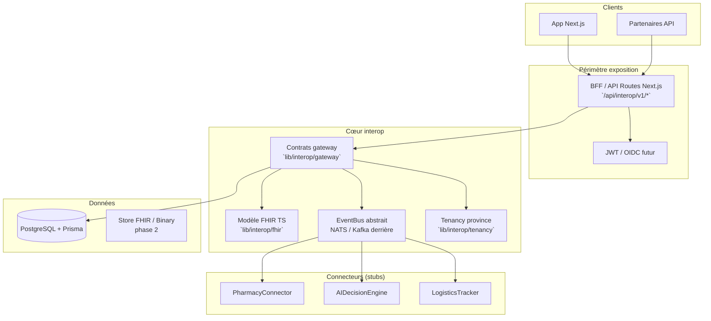
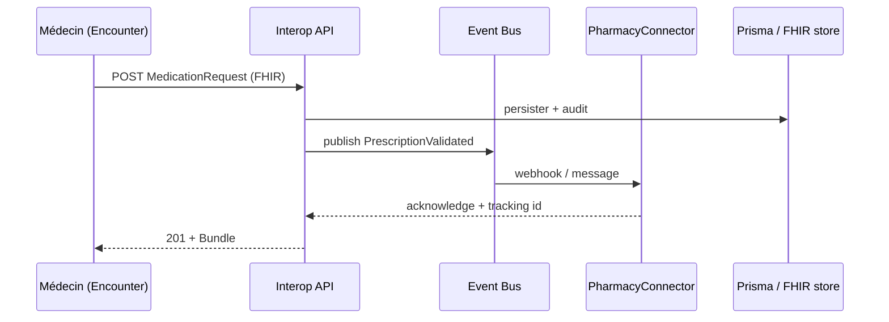

# Architecture d’interopérabilité Medsim

Objectif : couche **canonique FHIR R4**, bus d’événements, multi‑locataire par province, audit et contrats d’API — extensible vers gateway dédiée (NestJS), NATS/Kafka et connecteurs clinique.

## Vue logique (MVP dans ce dépôt)

## Flux prescription / synchronisation (cible)

## Principes de conformité (implémentation progressive)

| Exigence | MVP (ce repo) | Phase 2+ |
|---------|---------------|----------|
| **Loi 25 / vie privée** | Audit `AuditLog`, consentement versionné (schéma à ajouter), minimisation | DPIA, DPO, registre traitements |
| **HIPAA-like** | RBAC existant, TLS côté déploiement, secrets env | BAA, chiffrement at-rest managé |
| **FHIR R4** | Types TS + endpoints JSON nominalement conformes | Validation complète (HAPI / Iguana), CapabilityStatement |
| **ISO 27001 / SOC2** | Journalisation, séparation dev/prod | politiques documentées, pentest |

## Répertoires

| Chemin | Rôle |
|--------|------|
| `lib/interop/` | Types FHIR, tenancy, bus, contrats |
| `lib/metabolic/` | Normalisation FHIR métabolique, dashboards, profil agrégé |
| `app/api/interop/v1/` | Endpoints REST interop (MVP) |
| `services/pharmacy-connector/` | Worker / adaptateur pharmacie (stub) |
| `services/ai-decision-engine/` | Pipeline IA → FHIR (stub) |
| `services/logistics-tracker/` | Webhooks livraison (stub) |
| `services/metabolic-behavior-service/` | Agrégations métaboliques / bus (stub) |
| `.github/workflows/interop-ci.yml` | CI ciblé interop |

## Couche « Comportement métabolique »

- **FHIR** : `NutritionIntake` (repas / compléments via extension), `Observation` (sommeil, activité), `MedicationStatement` (GLP‑1).
- **API** : `docs/INTEROP_ENDPOINTS.md` (section métabolique) ; consentement explicite `POST …/metabolic/consent/dietary` avant toute ingestion.
- **Profil agrégé** : `MetabolicProfileSnapshot` + Observation panel ; recalcul via `POST …/metabolic/internal/recompute` (cron 24h).
- **RBAC** : `MEDECIN` → dashboard clinique ; `NUTRITIONNISTE` → dashboard alimentaire ; `PATIENT` → ingestion.

## Sécurité (cible production)

- **Transit** : TLS 1.3 en frontal (reverse proxy / CDN).
- **Repos** : chiffrement volumes DB et stockage objet (KMS, clés rotatives).
- **Logs** : expédition vers SIEM avec rétention légale ; idéalement chiffrement at-rest côté fournisseur.
- **Messagerie clinique E2E** : non couverte par ce MVP — intégrer un module dédié (ex. fournisseur certifié) et des exigences de conservation probatoire.

## Gateway NestJS (phase 2)

Pour monter un **vrai** API Gateway (rate limit global, policies, mTLS partenaires), extraire les handlers de `app/api/interop` vers un service `services/gateway-nest` et conserver Next comme front ; le document `services/gateway/README.md` décrit la migration.
